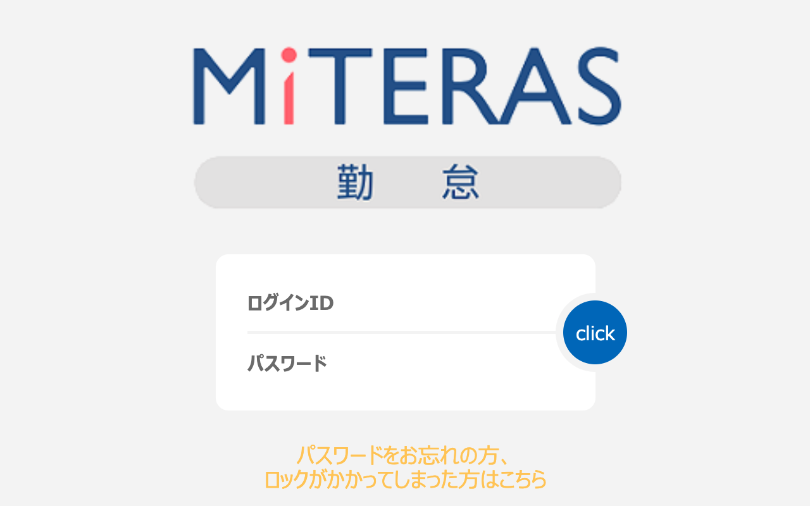

# 🚀 MiTERAS勤怠残業時間

これは、MiTERAS勤怠の累積残業時間を表示するChrome拡張機能です。

## インストール方法

Chromeウェブストアからインストールできます。

<https://chrome.google.com/webstore/detail/miteras-kintai-helper/mjhjomlbbamhklalmdldbpkagijidlkc>

## 使用方法

1. MiTERAS勤怠の就業状況一覧の画面を開く。
1. 表の一番右側の列に累積残業時間が表示されます。
